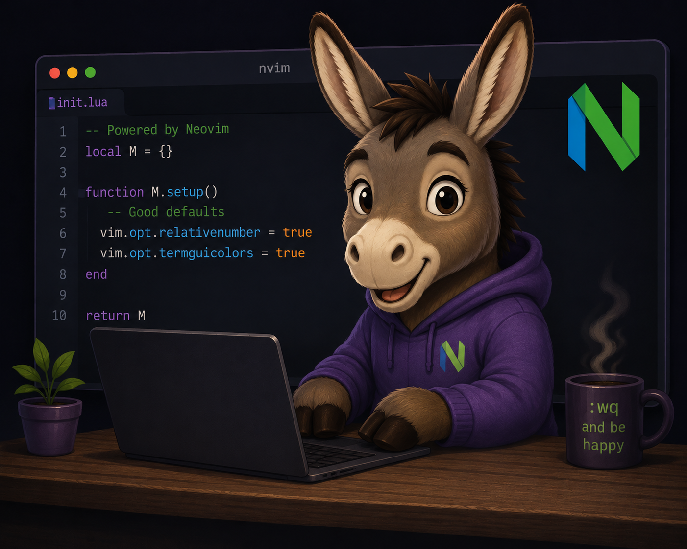

<div align="center">
  
</div>

# donkey.nvim

A Neovim plugin for integrating Asana project management into your workflow.

## Features

- Fetch Asana tasks and project information directly from Neovim
- Extract task IDs from git branch names (format: `feature/task-id/description`)
- Select project sections via interactive UI
- Move tasks between sections
- View task details and project memberships

## Requirements

- Neovim 0.5+
- [plenary.nvim](https://github.com/nvim-lua/plenary.nvim)
- An Asana Personal Access Token

## Installation

### Using [lazy.nvim](https://github.com/folke/lazy.nvim)

```lua
{
  "AranBorkum/donkey.nvim",
  dependencies = { "nvim-lua/plenary.nvim" },
  config = function()
    require("donkey").setup()
  end
}
```

### Using [packer.nvim](https://github.com/wbthomason/packer.nvim)

```lua
use {
  "AranBorkum/donkey.nvim",
  requires = { "nvim-lua/plenary.nvim" },
  config = function()
    require("donkey").setup()
  end
}
```

## Configuration

### Asana Access Token

Set your Asana Personal Access Token as an environment variable:

```bash
export ASANA_ACCESS_TOKEN="your_token_here"
```

You can generate a Personal Access Token from your [Asana Account Settings](https://app.asana.com/0/my-apps).

### Plugin Setup

```lua
require("donkey").setup({
  -- Add your configuration options here
})
```

## Commands

### `:AsanaSelectSection <project_id>`

Opens an interactive picker to select a section from an Asana project.

**Usage:**
```vim
:AsanaSelectSection 1234567890
```

### `:AsanaSelectProject <task_id>`

Opens an interactive picker to select a project for a given Asana task.

**Usage:**
```vim
:AsanaSelectProject 9876543210
```

## API

The plugin exposes several Lua functions that can be used in your own configurations:

### `require("donkey.asana").get_task(task_id)`

Fetches task details from Asana.

```lua
local asana = require("donkey.asana")
local task = asana.get_task("1234567890")
```

### `require("donkey.asana").get_project_sections(project_id)`

Fetches all sections for a given project.

```lua
local asana = require("donkey.asana")
local response = asana.get_project_sections("1234567890")
```

### `require("donkey.asana").add_task_to_section(section_id, task_id)`

Adds a task to a specific section.

```lua
local asana = require("donkey.asana")
asana.add_task_to_section("section_id", "task_id")
```

### `require("donkey.utils").get_task_id_from_branch()`

Extracts the task ID from the current git branch name.

```lua
local utils = require("donkey.utils")
local task_id = utils.get_task_id_from_branch()
-- For branch "feature/1234567890/add-new-feature" returns "1234567890"
```

## Workflow Example

1. Create a git branch following the convention: `feature/<task-id>/description`
   ```bash
   git checkout -b feature/1234567890/implement-new-feature
   ```

2. Use the plugin commands to interact with Asana tasks associated with your branch
   ```vim
   :AsanaSelectProject 1234567890
   ```

3. Move tasks between sections as your work progresses
   ```lua
   local asana = require("donkey.asana")
   local task_id = require("donkey.utils").get_task_id_from_branch()
   asana.add_task_to_section("section_id", task_id)
   ```

## Contributing

Contributions are welcome. Please open an issue or submit a pull request.

## License

MIT
